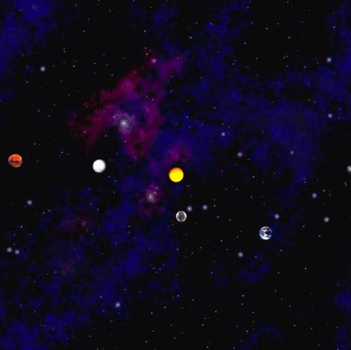

# NBody

NBody is a simulation of the motion of N bodies in a two-dimensional space, accounting for Newton's law of universal gravitation affecting the pairwise force between two particles, whose positions are represented using Cartesian coordinates.

 

Feature | Description
------- | -------
[Body](https://github.com/genielee55/NBody/blob/main/proj0/Body.java) | Creates bodies representing a planet, star, or various objects in this universe, and calculates its force and distance to other bodies, and updates the position/velocity of bodies after acceleration while obeying the laws of Newtonian physics.
[NBody](https://github.com/genielee55/NBody/blob/main/proj0/NBody.java) | Runs the simulation and creates animation using StdDraw class.
